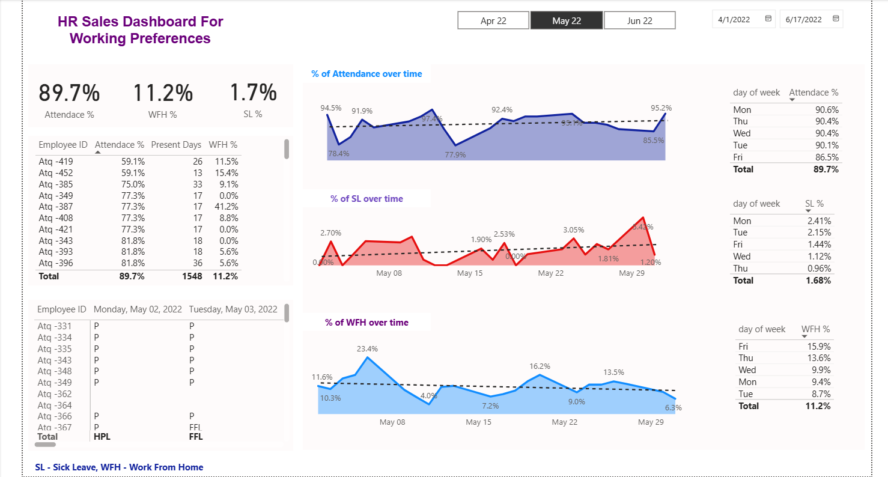
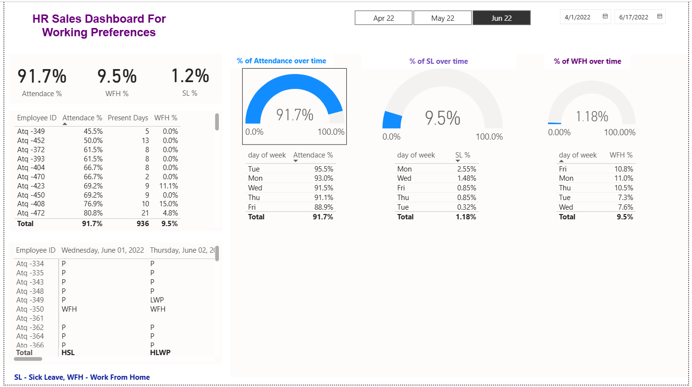

# HR Work Preference Dashboard  - Power BI

This dashboard analyzes employee work preferences such as remote work, flexible hours, work-life balance, and other contributing factors that impact overall job satisfaction and retention.

## 📊 Overview

This Power BI dashboard offers an interactive exploration of:
- Employee preferences for remote vs on-site work
- Desired working hours and flexibility
- Demographic breakdowns of work style preferences
- Trends in work satisfaction and organizational policies

## 🔍 Key Features
- Attrition breakdown by age, department, and job role
- Interactive filters
- Trendline on monthly attrition rate

## 📸 Preview
 
| Dashboard Screenshots  | 
|------------------------|
|  |

|  | 

## 🛠️ Tools Used

- **Power BI Desktop (.pbix)**
- **DAX** for calculated fields
- **Power Query (M)** for data cleaning
- **Excel** as the data source
- **Slicers & Drill-Downs** for interactivity
  

## Key Insights

- Majority of employees prefer hybrid work over full-time remote or in-office
- Younger employees (20–35) show a higher inclination toward flexible hours
- Work-life balance correlates strongly with satisfaction and lower attrition

## Business Use Case

This dashboard can help HR teams and business leaders:
- Align company policies with workforce preferences
- Design hybrid models for increased productivity
- Understand employee sentiment and improve retention

## Author’s Role

Biuld the data modeling, custom DAX measures, applied business logic, and designed interactive visuals to communicate trends clearly and effectively.
For data privacy reasons, this project uses anonymized or sample data.
